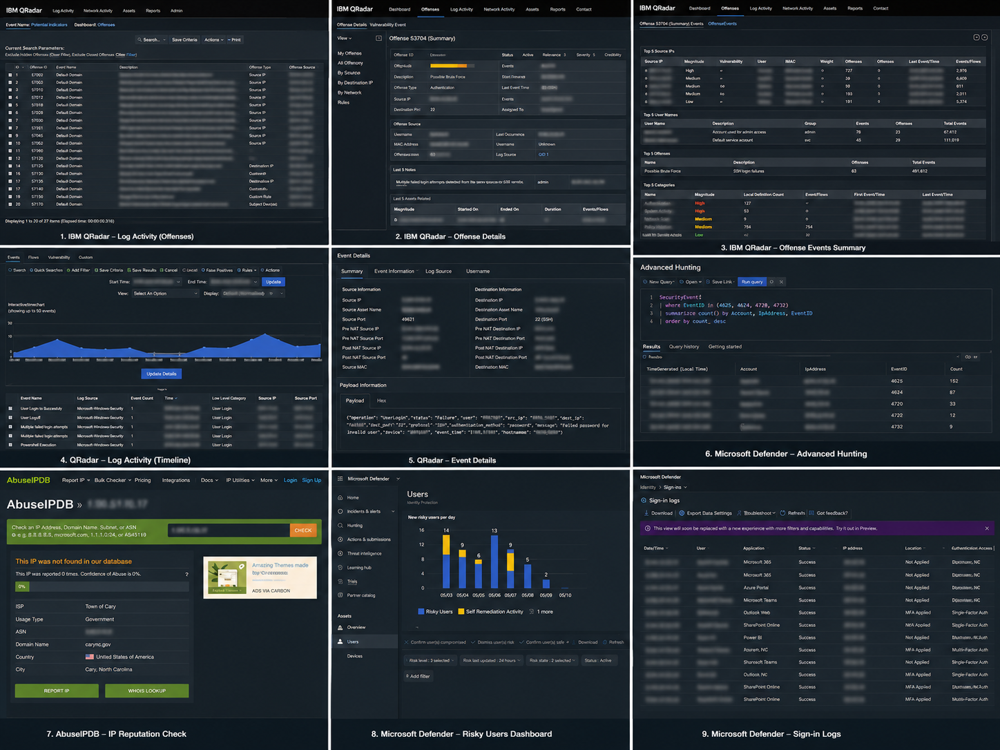

# Suspicious Microsoft 365 Authentication Activity Investigation

## Executive Summary

This investigation reviewed a QRadar offense involving Microsoft 365 authentication activity from a suspicious IP address. The activity was validated across QRadar, Microsoft Defender XDR Advanced Hunting, Microsoft Entra ID sign-in logs, Entra Risky Users, and AbuseIPDB.

The investigation determined that the activity was benign authentication behavior with no evidence of account compromise, endpoint compromise, malicious network activity, or elevated user risk.

## Investigation Evidence

### Authentication Investigation Workflow

## Key Findings

- QRadar generated multiple Microsoft 365 authentication events associated with a flagged IP address.
- Microsoft Defender XDR Advanced Hunting confirmed successful authentication activity.
- DeviceNetworkEvents returned no suspicious outbound endpoint communication.
- Entra ID sign-in logs showed successful MFA authentication.
- No associated risky users or high-risk sign-ins were identified.
- AbuseIPDB reputation review did not identify malicious infrastructure association.
- No evidence of credential compromise, malware execution, or lateral movement observed.

## Final Determination

The activity was determined to be benign authentication behavior and not indicative of account compromise or malicious activity.

## SOC Closure Note

Investigated suspicious Microsoft 365 authentication activity observed in QRadar. Validation performed using Microsoft Defender XDR Advanced Hunting, Entra ID sign-in logs, Entra Risky Users, and AbuseIPDB. Successful MFA-authenticated activity was confirmed with no associated malicious endpoint behavior, risky user indicators, or suspicious network activity identified. Activity determined to be benign authentication traffic. Offense closed as false positive.
